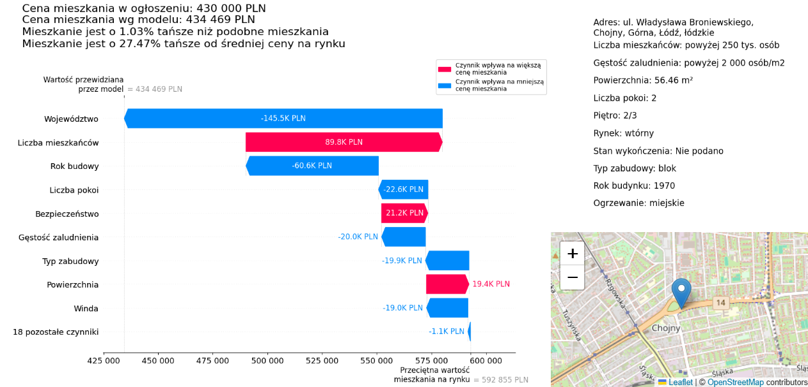

# Apartment Price Analysis Project
Based on the data obtained from a portal with advertisements with the sale of apartments, a model was trained that gives the forecast value of the apartment with a short report on what factors influenced the result of the model.

## Usage of the model:
<ul>
<li>starting point in determining the price of an apartment</li>
<li>quick assessment of the profitability of a given apartment (comparing the estimated price to the price in the ad)</li>
<li>quick assessment of what factors influence the estimated price</li>
<li>starting point for comparing several apartments or for negotiating the price</li>
</ul>

## The project consists of the following stages:
<ol>
<li>Transformation of data for modeling - transformation, analysis of gaps and outlier observations, selection of data for modeling and addition of data extracted from the address in the advertisement</li>
<li>Model training - appropriate coding of data, model selection and model training</li>
<li>Feature importance analysis (lokal)  - calculations with the help of a SHAP package and presentation on a graph</li>
<li>Creation of a report with a summary of the modeling result - visualization of model result and features importance</li>
</ol>

## Data used in the project:
The data for the project was taken from otodom.pl, a Polish website where users post ads for apartment sales. 
The data is from January 2024 and contains more than 47k observations. 
The following were <b>not</b> used:
<ul>
<li>data from photos </li>
<li>information provided in the verbal description given by the advertiser</li>
<li>data about the distance of the apartment to various amenities (bus stops, stores, schools, etc.)</li>
</ul>
Instead, information describing the locality (population, population density, and powiat rights of city) was added. <i>The powiat is a unit of local government and administrative division of the second degree in Poland. A city with powiat rights is the center of such a unit.</i>

## Project result
The precision of the model was about <b>83.4%</b> for the test data. This result was considered satisfactory for the data used and the complexity of the real estate valuation process.  
Example of the final report:
 
<i>The report was created for Polish users, so it is in Polish</i>
